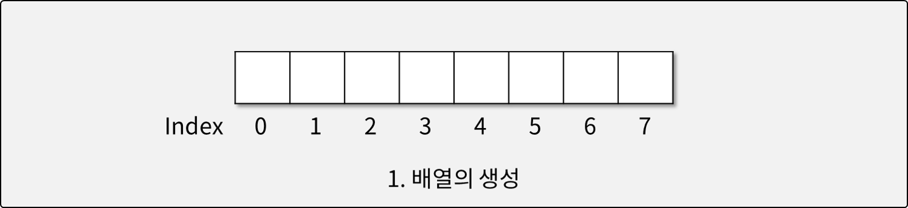
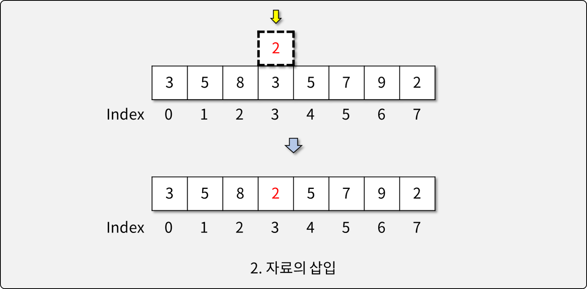
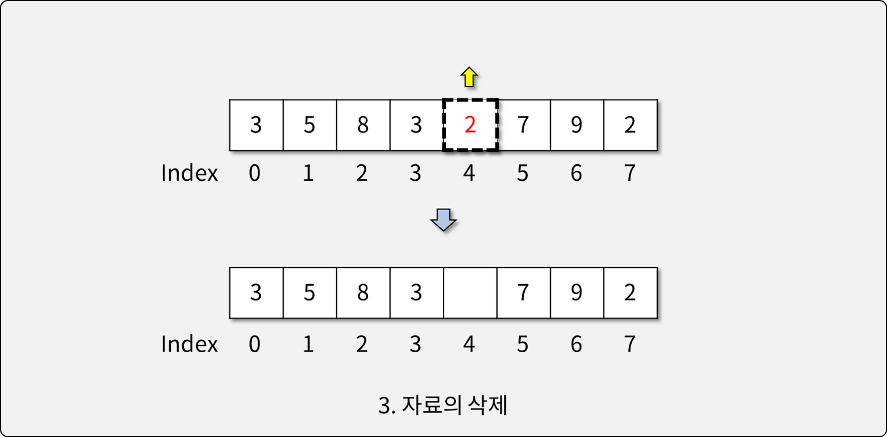
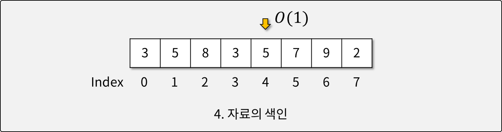

# 배열 (Arrays)

## 배열이란

- C 언어 기준의 배열로 이야기하고 있음
- **ArrayList**(JS에서 말하는 배열) vs. **TypedArray**(ArrayList와 달리 모든 요소들이 똑같은 자료형, 크기로 되어 있어야 함.)
- 다루는 자료의 수가 많아질 때, 이를 다루기 위해 사용하는 **자료 구조(DS)**
- 하나의 변수에 여러 자료를 저장할 수 있으며, 반복문을 이용해 *효율적*으로 처리 가능
- 배열에서 인덱스는 유일무이한 식별자(Identifier)로 사용된다.
  - 즉 인덱스1과 인덱스 2에 각각 '4'라는 동일한 값이 들어있더라도 인덱스가 다르기 때문에 이 둘은 다름.

## 배열의 특징

- 크기(Element의 개수)가 정해져 있다. -> 처음 생성시부터 크기를 지정해 줘야 함.
- 자료 구조에 기능(메소드)이 포함되어 있지 않다. -> 그냥 자료 저장소의 역할만을 함.
- *★자료가 메모리상에 빈틈 없이 연속적으로 위치해 있다.*
- 인덱스를 활용하여 자료에 '순차적으로' 빠르게 접근할 수 있다.(참고로 ArrayList는 메모리를 왔다갔다 해야 함.)

## 배열의 단점

- 배열의 길이는 생성 시 정해져, 변경할 수 없다.
  - 가변 길이 배열은 배열의 크기를 변경할 때 마다 새 배열을 만든 후 이전 배열에서 자료를 복사해와야 함.->오버헤드(실제로 필요한 동작 외의 추가적인 동작이 들어가서 연산 등에서의 낭비가 발생하는 것)
- Element를 제거할 경우, 배열에 빈 틈이 생긴다.
  - 기존 Element의 인덱스를 유지하기 위해 빈 틈을 유지한다.
  - Array에는 '길이'의 2가지 개념이 있음
    - 첫째, capacity : 여기에 몇 개까지 저장할 수 있는지 용량을 만드는 것
    - 둘째, length : 어디까지 사용하고 있고 그 뒤는 의미 없다고 생각하는 것.
    - 즉, element는 제거되지 않지만 제거되었다고 생각하고 빈 틈으로 두는데 이 때 capacity는 줄어들지 않고 length만 줄어들게 되는 것.

## 배열의 활용

- 배열의 생성
  
  - 배열 생성 시 언어에 따라 0으로 초기화 되는 경우도 있고 아닌 경우도 있음
- 자료의 삽입
  
  - 그냥 덮어쓰면 됨.
- 자료의 삭제
  
  - 삭제는 따로 없고 삭제했다치고 안쓰면 됨.
- 자료의 색인
  
  * 인덱스로 접근하는 것을 의미
  * Big0(1) : 단숨에 접근할 수 있음

## JavaScript와 배열

- JavaScript의 Array는 배열 자료구조와는 다르며, 고수준의 기능을 포함한다.
- JavaScript에서 배열과 유사한 자료구조는 **형식화 배열(Typed Array)**이다.
  - `Int8Array`, `Uint8Array`(U=Unsigned : 양수만), `Uint8ClampledArray`(Clamped : 0보다 작은 값이 들어오면 0으로 바꿔주고 255보다 큰 수가 들어오면 알아서 255로 바꿔줌), `Int16Array`, `Uint16Array`, `Int32Array`, `Uint32Array`, `Float32Array`, `Float64Array` 
  - 형식화 배열은 특정 형식의 Element만을 허용한다. -> 그래야 메모리에 연속되게 할 수 있고 한 칸의 크기를 알 수 있기 때문.
  - 형식화 배열은 자료가 메모리에 연속적으로 배치되는 것을 보장한다.
  - C언어 수준의 최적화를 보장한다.
