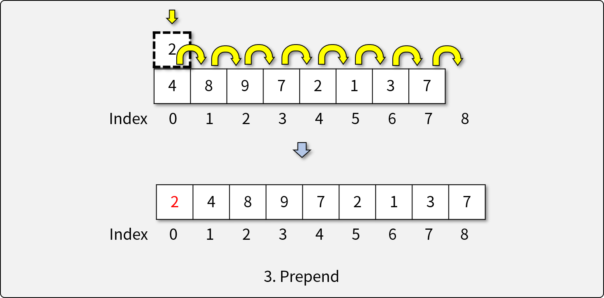
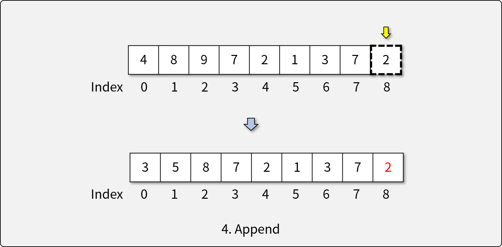
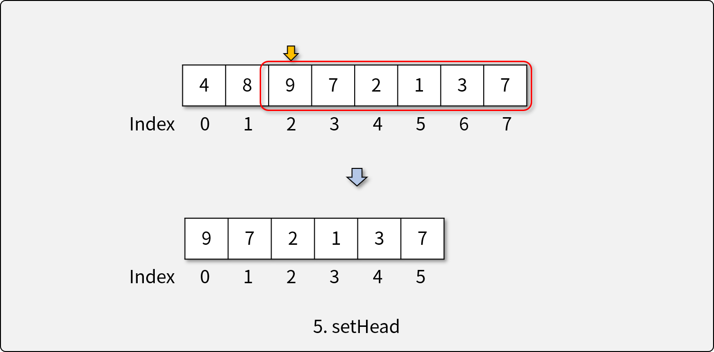
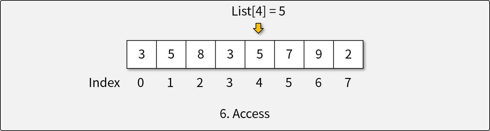
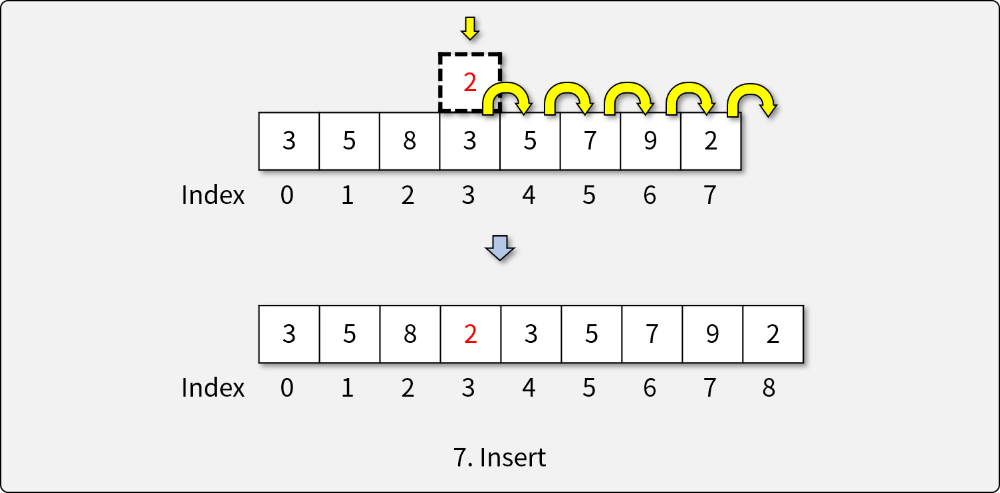
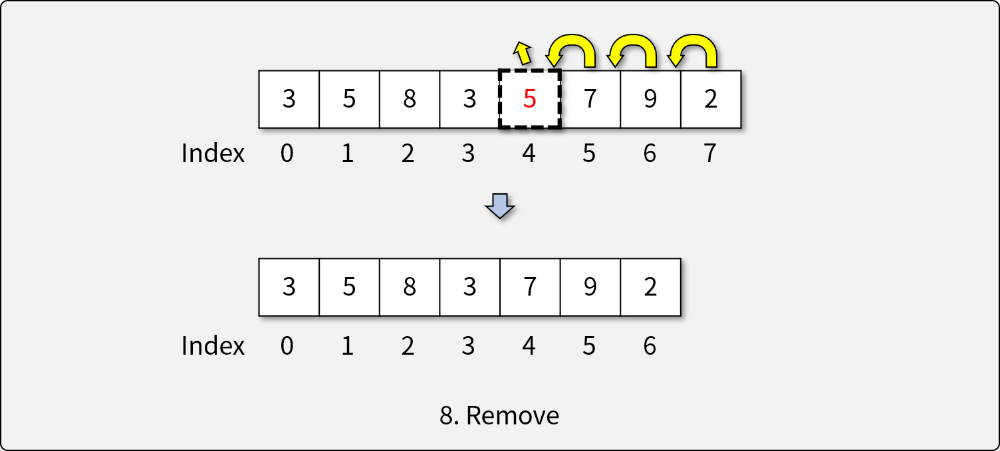
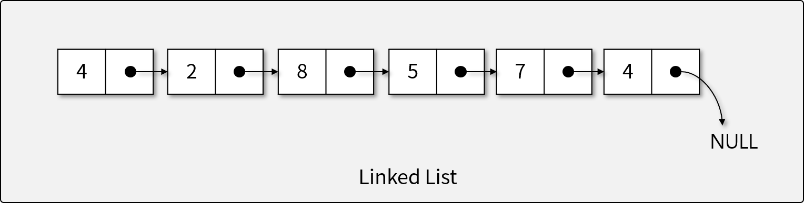

# 리스트 (Lists)

## 리스트란

- Array에서 많이 바뀌지 않음.
- 순차적인 데이터(Sequential Data)를 다루기 위한 **추상 자료형** 
  - Array는 순차적으로 쓸 수 있을 뿐이지 순차적인 것은 아님. 리스트는 반드시 순서대로 차 있어야 함.
- 리스트에는 동일한 값이 여럿 존재할 수 있으며, 이는 서로 다른 항목으로 구분된다. -> 몇 번째 있는 데이터냐를 가지고 구분

## 리스트의 연산자 (Operators)

* 연산자는 있으나 구현하는 방법은 안 나와 있음.

1. 비어있는 리스트를 생성하는 생성자
  
  * 생성 시 capacity를 정할 수도 안 정할 수도 있음.
1. 리스트가 비어있는지 확인하는 연산자
1. 리스트의 앞에 개체를 삽입(prepending)하는 연산자

1. 리스트의 뒤에 개체를 삽입(appending)하는 연산자

1. 리스트의 첫 머리(head)를 결정하는 연산자

1. 주어진 인덱스에 해당하는 요소에 접근하는 연산자

1. 주어진 인덱스에 새로운 요소를 삽입하는 연산자

1. 주어진 인덱스에 해당하는 요소를 제거하는 연산자

## 리스트의 구현

### 1) 배열 리스트 (Array List)

- 배열을 기반으로 만들어진 리스트
- 가변 길이를 가지는 배열을 이용하여 리스트 구현 : 가변 길이 만드는 방법은 새로운 배열을 만들어서 기존 것을 카피하는 것.
- Array List에서 각 연산의 복잡도
  - `isEmpty()`: O(1)
    - 자료를 하나하나 넣을 때마다 length를 알고 있으면 됨. length라는 변수를 미리 기억하고 있으면 됨.
  - `prepend()`: O(n)
    - n개를 뒤로 밀어야 하기 때문에 n개
  - `append()`: O(n) **(조건부 O(1))**
    - O(n) : 크기를 늘려줘야 하는 경우, 전체를 복사해야 하므로 이만큼의 시간이 걸림.
    - 조건부 O(1) : 가변 길이에서 길이를 늘릴 필요가 없으면->맨 뒤에 그냥 써주면 되기 때문->그러나 대부분이 이 케이스
  - `setHead(index)`: O(1)
    - 인덱스 위치만 알면 바로 할 수 있으므로
  - `access(index)`: O(1)
    - Array로 구현되어 있으므로 바로 접근 가능
  - `insert(item, index)`: O(n)
    - 최선의 경우 O(1)일 수 있긴 함.
  - `remove(index)`: O(n)
    - 중간의 것을 제거하면 다 당겨줘야 하므로.

### 2) 연결 리스트 (Linked List)

- 단방향(Singly Linked List) 또는 양방향(Doubly Linked List) -> 여기서는 단방향만 이야기
- 사진의 점들은 NEXT임. 4는 value. 각각 2개의 칸은 value, next로 이루어진 하나의 객체임. next로 자료들이 연결되어 있음.
- 각 요소는 값(Value)과 다음 요소를 *가르키는* 연결(Link)로 구성
- 연결 리스트에서 각 연산의 복잡도
  - `isEmpty()`: O(1)
  - `prepend()`: O(1)
  - `append()`: O(n)
  - `setHead(index)`: O(n)
  - `access(index)` : O(n)
  - `insert(item, index)`: O(1) (w/o access)
  - `remove(index)`: O(1) (w/o access)

## JavaScript와 리스트

- JavaScript의 Array는 추상 자료형인 리스트를 구현한 **자료 구조**이다.
- Array에 구현된 리스트의 기능 (*`italic`*: trivial하게 구현 가능 : 정확하게 그 메소드는 없지만 기존의 메소드를 활용하면 구현할 수 있다는 의미)
  - 비어있는 리스트를 생성하는 생성자 (`constructor`)
  - 리스트가 비어있는지 확인하는 연산자 (*`array.length`*)
  - 리스트의 앞에 개체를 삽입(prepending)하는 연산자 (`array.unshift`)
  - 리스트의 뒤에 개체를 삽입(appending)하는 연산자 (`array.push`)
  - 리스트의 첫 머리(head)를 결정하는 연산자 (*`array.slice`*; ~~O(1)~~ O(n))
  - 주어진 인덱스에 해당하는 요소에 접근하는 연산자 (`array[index]`)
  - 주어진 인덱스에 새로운 요소를 삽입하는 연산자 (*`array.slice` + `array.join`*)
  - 주어진 인덱스에 해당하는 요소를 제거하는 연산자 (*`array.splice`*)

## [실습] Array List 직접 구현하기

- **JavaScript의 TypedArray를 이용해 Array List 직접 구현하기** -> C스타일의 방식으로 구현하는 것
- **구현 조건**
  - `class`와 `Int32Array`를 이용하여 Array List를 구현한다.
  - `Int32Array`의 용량(capacity)은 고정되어 있다고 가정한다.
    - 배열의 크기가 부족할 때 마다 2배 길이의 `Int32Array`를 새로 생성한다.
  - 다음과 같은 리스트 ADT의 연산자를 구현해야 한다.
    1. 비어있는 리스트를 생성하는 생성자
    1. 리스트가 비어있는지 확인하는 연산자
    1. 리스트의 앞에 개체를 삽입(prepending)하는 연산자
    1. 리스트의 뒤에 개체를 삽입(appending)하는 연산자
    1. 리스트의 첫 머리(head)를 결정하는 연산자
    1. 주어진 인덱스에 해당하는 요소에 접근하는 연산자
    1. 주어진 인덱스에 새로운 요소를 삽입하는 연산자
    1. 주어진 인덱스에 해당하는 요소를 제거하는 연산자
- **참조 코드**
  - [기반 소스 코드](src/before.js)
  - [솔루션 코드](src/after.js)
