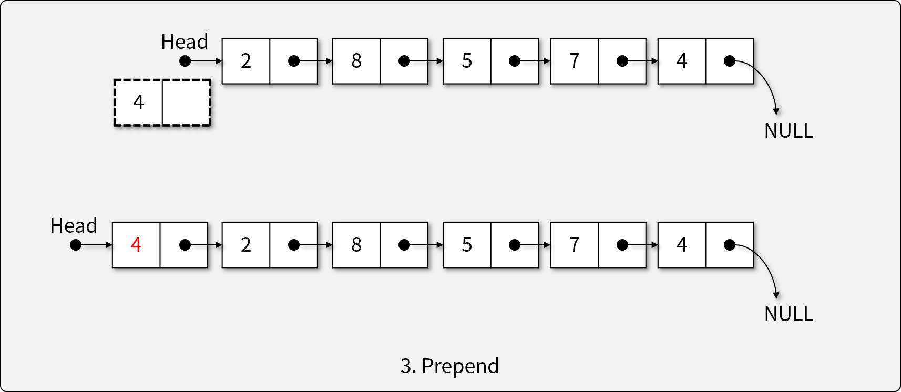
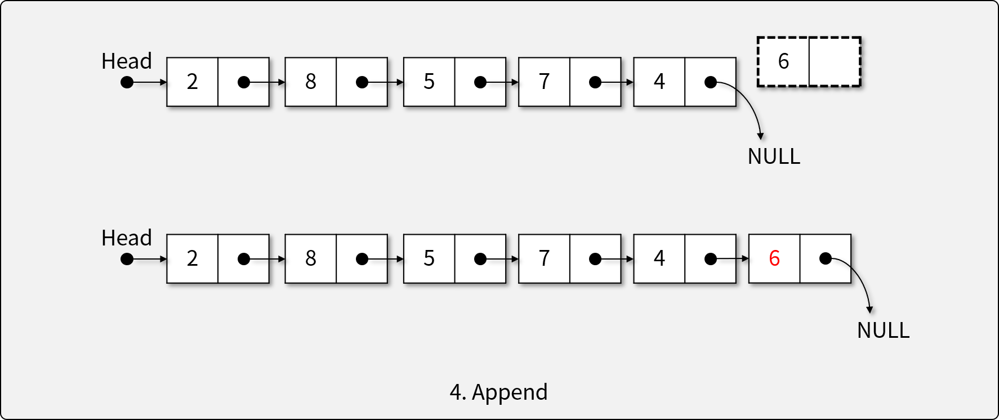
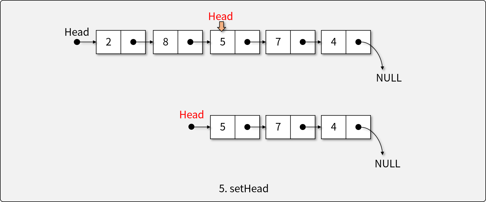
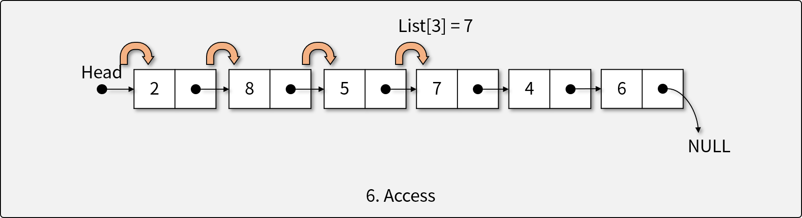
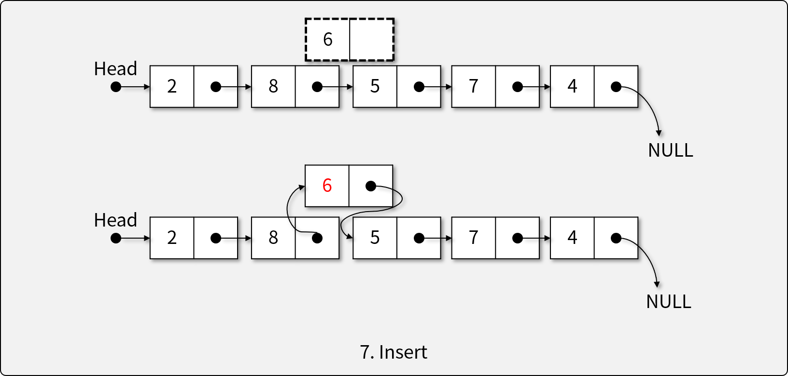
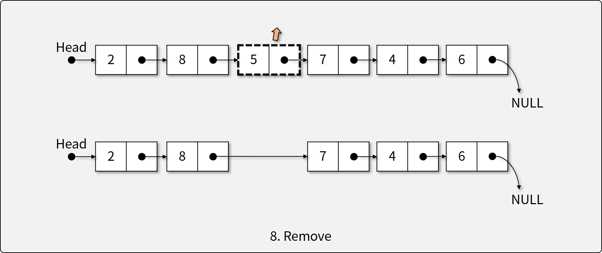
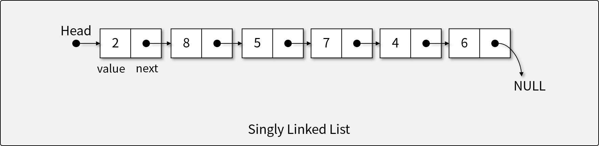
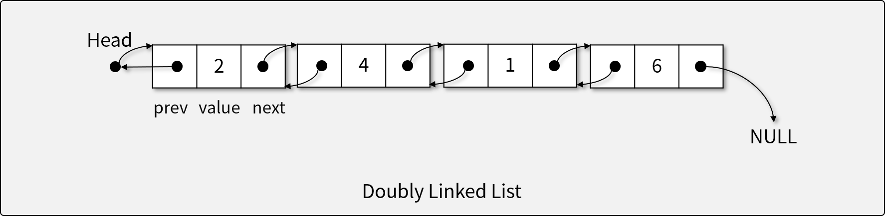

# 연결 리스트 (Linked List)

## 연결 리스트란

- 연결 리스트는 순서가 메모리 상의 물리적인 위치로 정의되지 않는 자료의 선형적 모임을 나타내는 **자료 구조**이다.
  - 어레이리스트는 메모리에 연속적으로 있는 것이 보장되었음. 따라서 메모리상 물리적인 위치가 보장이 됨.
- 자료의 순서는 정해져 있으나, Array List와 달리 메모리상 연속성이 보장되지 않는다.
- 값과 포인터(또는 레퍼런스-참조값-, next=>다음 node를 가리킴)를 가진 `Node`의 집합으로 구현한다.

## 리스트의 연산자

1. 비어있는 리스트를 생성하는 생성자
  
  * head가 null을 가리키는지 아닌지를 확인
1. 리스트가 비어있는지 확인하는 연산자
1. 리스트의 앞에 개체를 삽입(prepending)하는 연산자
  
  * head는 새로 들어온 노드를 가리키게 됨 & 새로 들어온 노드는 기존 노드를 가리킴.
1. 리스트의 뒤에 개체를 삽입(appending)하는 연산자
  
  * head에서 시작하여 null까지 찾아감
  * 마지막 노드에서 넥스트가 새로운 것을 가리키게 하고 & 새로운 것은 null을 가리키게 함.
1. 리스트의 첫 머리(head)를 결정하는 연산자
  
  * 먼저 목표한 노드를 찾음 -> 헤드를 목표한 노드로 바꿈
  * 그럼 앞에 있는 2, 8은 더 이상 참조가 되지 않고 garbage collector에 의해 사라짐
1. 주어진 인덱스에 해당하는 요소에 접근하는 연산자
  
  * Array와 달리 인덱스로 바로 접근 불가. 왜 ? 이건 헤드만 가지고 있기 때문
1. 주어진 인덱스에 새로운 요소를 삽입하는 연산자
  
  * 2번 인덱스에 넣고 싶을 때 : 8번이 가리키는 것을 6번이 가리키게 하고 & 6번은 5번을 가리키게 함
1. 주어진 인덱스에 해당하는 요소를 제거하는 연산자
  

  * 8이 7을 가리키게만 하면 됨. 5는 가비지 컬렉터에 의해 사라지게 됨.

## 연결 리스트의 구현

- 각 `Node`는 `value`와 연결된 다른 `Node`를 *가르키는* 연결(Link)로 구성
  - 연결 리스트에서 각 연산의 복잡도 (ArrayList vs. LinkedList)
    - `isEmpty()`: O(1)
    - `prepend()`: O(1) -> ArrayList : O(n)
    - `append()`: O(n) -> 이건 데이터를 옮기는 시간이 아닌 찾아가는 시간. O(n)에 가까운 O(1). 어레이리스트는 O(1)
    - `setHead(index)`: O(n) -> o(1)에 가까운 o(n)
    - `access(index)`: O(n) -> 어레이리스트와 비교했을 때 단점
    - `insert(item, index)`: O(1) (w/o access) -> 접근은 o(n)
    - `remove(index)`: O(1) (w/o access)
    - ArrayList에 비해 접근하는데 시간은 훨씬 적게 듦. -> 상당 부분이 ArrayList에 비해 빠름.

### **1) 단방향 연결 리스트 (Singly Linked List)**

- Head Node(첫 Element)를 시작으로 단방향으로 연결된 연결 리스트
  - 각 `Node`는 `value`와 `next` property를 지닌다.
- 일자로 연결된 가장 간단한 형태의 연결 리스트이다.

### **2) 양방향 연결 리스트 (Doubly Linked List)**

- 단방향 연결 리스트에 `prev`를 포함시켜 양방향으로 연결된 연결 리스트
- 이전 Node로 돌아갈 수 있어, insert와 remove 연산에 유리하다.
  - insert와 remove를 하려면 insert는 앞과 뒤를 알아야 그 사이에 끼어넣을 수 있음. -> 양방향이면 저 3쪽자리 하나만 알고 있으면 끼어넣을 수 있음.
- 이 사진에서 prev는 head가 아닌 null을 가리켜야 함. 잘못 나옴.

## [실습] Linked List 직접 구현하기

- JavaScript의 `class`를 이용해 Singly Linked List 및 Doubly Linked List 직접 구현하기
- **구현 조건**
  - **단방향 연결 리스트 (Singly Linked List)**
    - `value`와 `next` property를 지닌 `Node` 클래스를 구현한다.
    - `Node`를 이용하여 Singly Linked List를 구현한다.
    - 다음과 같은 리스트 ADT의 연산자를 구현해야 한다.
      1. 비어있는 리스트를 생성하는 생성자
      1. 리스트가 비어있는지 확인하는 연산자
      1. 리스트의 앞에 개체를 삽입(prepending)하는 연산자
      1. 리스트의 뒤에 개체를 삽입(appending)하는 연산자
      1. 리스트의 첫 머리(head)를 결정하는 연산자
      1. 주어진 인덱스에 해당하는 요소에 접근하는 연산자
      1. 주어진 인덱스에 새로운 요소를 삽입하는 연산자
      1. 주어진 인덱스에 해당하는 요소를 제거하는 연산자
  - **양방향 연결 리스트 (Doubly Linked List)**
    - `value`, `next`, 그리고 `prev` property를 지닌 `Node` 클래스를 구현한다.
    - `Node`를 이용하여 Doubly Linked List를 구현한다.
    - 다음과 같은 리스트 ADT의 연산자를 구현해야 한다.
      1. 비어있는 리스트를 생성하는 생성자
      1. 리스트가 비어있는지 확인하는 연산자
      1. 리스트의 앞에 개체를 삽입(prepending)하는 연산자
      1. 리스트의 뒤에 개체를 삽입(appending)하는 연산자
      1. 리스트의 첫 머리(head)를 결정하는 연산자
      1. 주어진 인덱스에 해당하는 요소에 접근하는 연산자
      1. 주어진 인덱스에 새로운 요소를 삽입하는 연산자
      1. 주어진 인덱스에 해당하는 요소를 제거하는 연산자
- **참조 코드**
  - 단방향 연결 리스트
    - [기반 소스 코드](src/SLL/before.js)
    - [솔루션 코드](src/SLL/after.js)
  - 양방향 연결 리스트
    - [기반 소스 코드](src/DLL/before.js)
    - [솔루션 코드](src/DLL/after.js)
