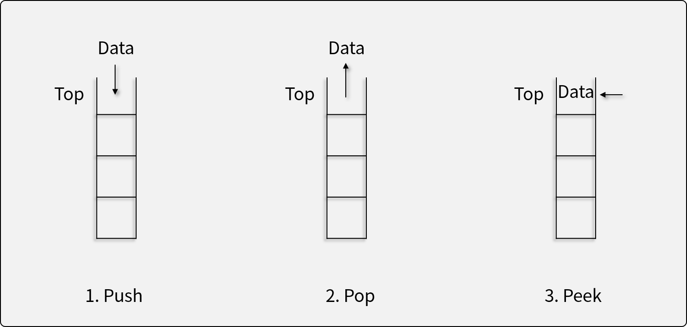
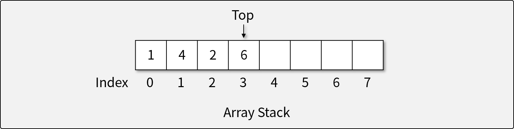

# 스택 (Stack)

## 스택이란

- 스택은 후입선출(Last In First Out; LIFO)의 특성을 가지는 **추상 자료형**이다.
- 자료가 입력된 순서의 역순으로 처리되어야 할 때 사용한다.
  - ex) **프로토타입 체인**(마지막에 체이닝한 것이 먼저 참조), 함수 콜 스택, OS(OS내의 아주 많은 것들이 스택으로 되어 있음) 등

## 스택의 연산자

1. 자료를 Top 위에 삽입하는 연산자 (Push)
    더 이상 삽입할 수 없는 경우 *오버플로우* 발생 (~~스택 오버플로우~~)
1. 자료를 Top에서 꺼내는 연산자 (Pop)
    더 이상 꺼낼 수 없는 경우 *언더플로우* 발생
1. Top에 있는 자료를 반환하지만, 삭제하지는 않는 연산자 (Peek) -> 그냥 TOP에 있는 자료를 확인만 하는
1. 스택이 비어있는지 확인하는 연산자 (Empty)

## 스택의 구현

- 배열을 이용하여 구현한 스택 
  - 성능이 매우 중요하고 코어하게 있기 때문에 동작 속도가 빠른 배열로 구현해야 함.
  - 배열을 사용하므로, 크기가 정해져 있다. -> 그래서 overflow가 발생하는 것
  - 메모리 상으로 연속되게 존재하기 때문에 동작 속도가 빠르다.
  - for문으로 하게 될 경우 매우 느림

## [실습] 스택 구현하기

- JavaScript의 Array를 이용해 직접 구현하기
- **구현 조건**
  - `class`와 `Array`를 이용하여 스택을 구현한다.
  - `Array`의 용량(capacity)은 고정되어 있다고 가정한다.
    - 배열의 크기가 부족하면 *오버플로우*가 발생한다.
  - 다음과 같은 스택 ADT의 연산자를 구현해야 한다.
    1. 자료를 Top 위에 삽입하는 연산자 (Push)
        더 이상 삽입할 수 없는 경우 *오버플로우* 발생 (에러 발생)
    1. 자료를 Top에서 꺼내는 연산자 (Pop)
        더 이상 꺼낼 수 없는 경우 *언더플로우* 발생 (에러 발생)
    1. Top에 있는 자료를 반환하지만, 삭제하지는 않는 연산자 (Peek)
    1. 스택이 비어있는지 확인하는 연산자 (Empty)
- **참조 코드**
  - [기반 소스 코드](src/before.js)
  - [솔루션 코드](src/after.js)
