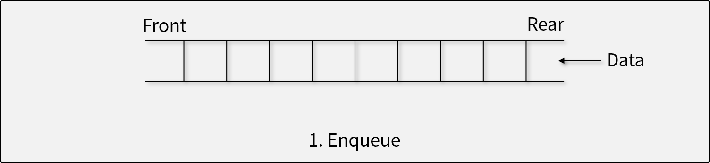
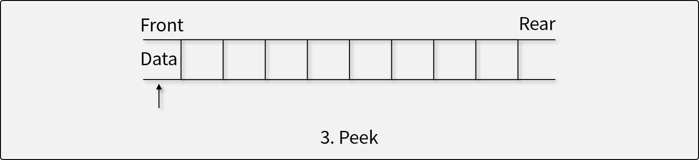
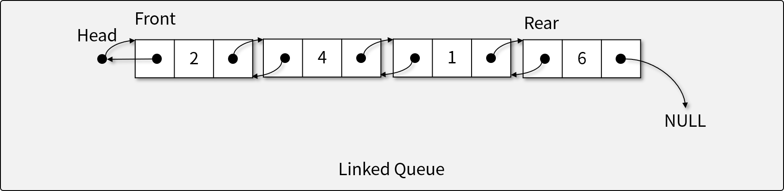

# 큐 (Queue)

## 큐란

- 큐는 선입선출(First In First Out; FIFO)의 특성을 가지는 **추상 자료형**이다.
- 입력된 데이터가 순서대로 처리되어야 할 때 사용한다. (First Come, First Served.)
  - 큐가 사용되는 애플리케이션 : 네트워크

## 큐의 연산자

1. 자료를 Rear로 삽입하는 연산자 (Put, Enqueue[인큐])

  
  * 더 이상 삽입할 수 없는 경우 *오버플로우* 발생 : 반드시 오버플로우가 발생하는 큐도 있고 아닌 큐도 있음
  * 큐의 오버플로우를 이용한 공격 : DDos(요청을 엄청나게 보내서 큐가 터져서 서버가 죽게되는)
  
  * stack의 push와 유사
  
1. 자료를 Front에서 꺼내는 연산자 (Get, Dequeue[디큐])

  더 이상 꺼낼 수 없는 경우 *언더플로우* 발생
  
1. Front에 있는 자료를 반환하지만, 삭제하지는 않는 연산자 (Peek)

## 큐의 구현

- **선형 큐 (Linear Queue)**
  
  - Array를 기반으로 함.
  - Rear와 Front가 일직선으로 전진하는 구조. : 들어올때마다 rear가 왼쪽으로 이동, 나갈 때마다 front가 오른쪽으로 이동. 즉 고정되어 있는 게 아님.
  - 한 번 사용한 메모리 공간이 버려지는 문제가 있다.
    * 모든 요소를 일부러 앞으로 당겨주는 작업을 하지 않으면 필연적으로 Overflow가 발생
  - 실제로 사용하는 구조는 아님
- **환형 큐 (Circular Queue)**

  - 선형 큐의 끝 부분을 서로 연결하는 구조.
  - 선형 큐와 달리, 한 번 사용한 메모리도 다시 활용할 수 있다.
  - array로 되어 있기 때문에 동작 속도가 빠름
    - 큐의 용량을 모두 사용하기 전에는 Overflow가 발생하지 않음
- **연결리스트 큐 (Linked Queue)**

  - 보통 doubly linked list를 이용해 큐 구성
  - 물리적인 메모리를 모두 사용하기 전까지 Overflow가 발생하지 않음 -> 따라서 안정적인 큐를 만들어야 한다면 linked queue를 만들면 됨. 그러나 속도는 좀 느림.
  - DLL와의 차이점 : DLL이 조금 더 큰 집합 개념

## [실습] 선형 큐, 환형 큐, 연결리스트 큐 구현하기

- JavaScript의 Array와 연결 리스트를 이용해 직접 구현하기
- **구현 조건**
  - `class`와 `Array`, 그리고 `LinkedList`를 이용하여 선형 큐, 환형 큐, 연결리스트 큐를 구현한다.
  - `Array`의 용량(capacity)은 고정되어 있다고 가정한다.
    - 배열의 크기가 부족하면 *오버플로우*가 발생한다.
    - 연결리스트 큐는 오버플로우가 발생하지 않는다.
  - 다음과 같은 큐 ADT의 연산자를 구현해야 한다.
    1. 자료를 Rear로 삽입하는 연산자 (Put, Enqueue)
      더 이상 삽입할 수 없는 경우 *오버플로우* 발생
    1. 자료를 Front에서 꺼내는 연산자 (Get, Dequeue)
      더 이상 꺼낼 수 없는 경우 *언더플로우* 발생
    1. Front에 있는 자료를 반환하지만, 삭제하지는 않는 연산자 (Peek)

- **참조 코드**
  - 선형 큐
    - [기반 소스 코드](src/linearQ/before.js)
    - [솔루션 코드](src/linearQ/after.js)
  - 환형 큐
    - [기반 소스 코드](src/circularQ/before.js)
    - [솔루션 코드](src/circularQ/after.js)
  - 연결리스트 큐
    - [기반 소스 코드](src/linkedQ/before.js)
    - [솔루션 코드](src/linkedQ/after.js)
