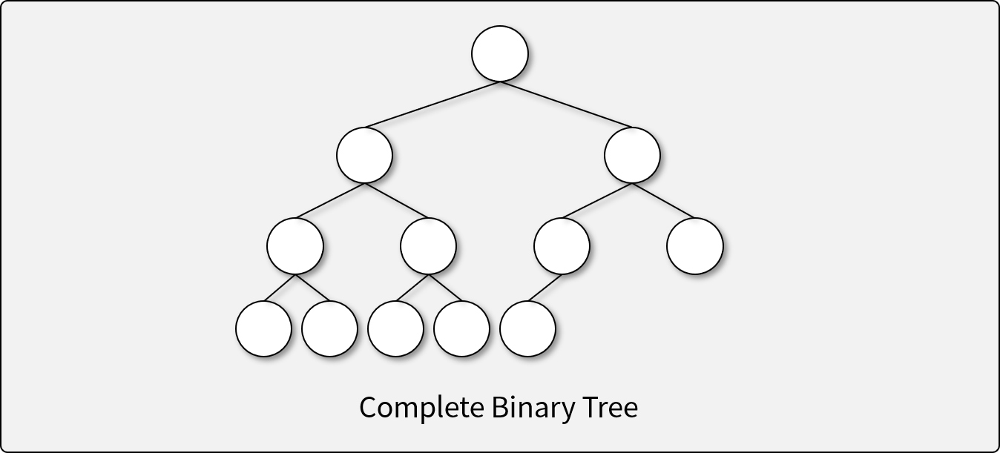
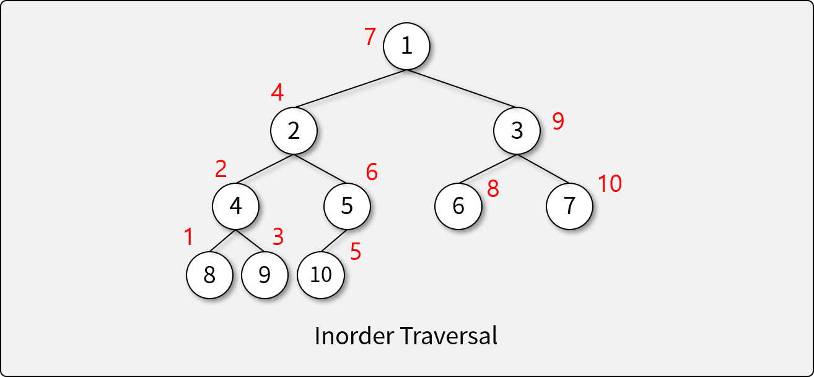

# Tree

## 트리란

- 비선형 구조
- 그래프의 일종으로, 여러 노드가 한 노드를 가르킬 수 없는 구조
- 회로(Cycle)이 없고, 두 노드를 잇는 길이 하나뿐인 그래프

## 트리의 구조

- 루트(Root): 부모가 없는, 가장 상윗단의 노드 = Lv.0, depth 0
- 노드(Node): 트리 구조의 자료 값을 담고 있는 요소
- 에지(Edge): 노드 간의 연결선
- 부모(Parent): 연결된 두 노드 중 더 상위에 있는 노드
- 자식(Child): 연결된 두 노드 중 하위에 있는 노드
- 경로(Path): 두 노드를 연결하는 에지의 시퀀스. a와 b의 path는 무조건 하나밖에 안 나옴. 왜? 여러 노드가 한 노드를 가리키지 않기 때문
- 잎새 노드(Leaf Node): 자식 노드가 없는 노드
- 내부 노드(Internal Node): 잎새 노드를 제외한 모든 노드
- 레벨, 깊이(Level, Depth): 루트 노드로부터의 경로의 길이
- 트리의 높이(Height): 트리에서 가장 큰 레벨 값

## 트리의 특징

- 하나의 노드에서 다른 노드로 이동하는 경로는 유일
- Acyclic하다. (Cycle이 존재하지 않는다)
- 모든 노드는 서로 연결되어 있다. (외딴 섬이 존재하지 않는다.) -> 'connected'
- ★ 하나의 Edge를 끊으면 두개의 Sub-Tree로 분리된다.
- ★ Edge의 수는 [Node의 수 - 1]이다.

## 이진 트리 (Binary Tree)

### 이진 트리의 종류

* 하나의 부모가 최대 2개까지의 자식을 갖는 것(가지고 있지 않을 수도 있음)

####1) 정 이진 트리 (Full Binary Tree, Perfect Binary Tree)

####2) 완전 이진 트리 (Complete Binary Tree)

- 가장 많이 다루게 될 트리
- 순서대로 차다가(좌->우) 중간부터 안 차있는 경우
- 포함 관계 : 완전 이진 트리 > 정 이진 트리(완전 이진 트리 중에 끝까지 꽉 차 있는 게 정 이진 트리)

####3) 균형 이진 트리 (Balanced Binary Tree)

* 깊게 다루진 않을 것
* skewed tree(한쪽으로 쏠려 있는 트리)와 반대 개념
* balanced binary tree 정의 기준
  * 왼쪽과 오른쪽의 레벨 차이가 1이하인 경우에 balanced binary tree 라고 정의하는 알고리즘도 있고, 
  * 좌우의 노드 수 차이가 3이하인 경우를 balanced binary tree라고 정의하는 알고리즘도 있음
  * 위의 그림 예시는 위 2개의 정의를 만족하기는 함

### 이진 트리의 순회 (Traversal)

* 노드를 언제 읽느냐를 기준으로 나눠짐. recursive function으로 구현했음

####1) 깊이 우선 순회 (Preorder, Depth-First Traversal) 

* 순서 : `node` -> `left` -> `right`
* node를 먼저 보기 때문에 'preorder'라고 부름. 그리고 깊이를 쭉 따라가면서 읽어줬기 때문에 '깊이 우선 순회'
* 그림 예시는 완전 이진 트리

####2) 대칭 순회 (Inorder, Symmetric Traversal) 

* 순서 : `left` -> `node` -> `right`(노드가 중간에 있어서 inorder라고 부름)
* 루트에서 left로 쭉 내려가서 8에 다다랐을 때 더 내려갈 left가 없어서 그 때부터 읽음

####3) 후위 순회 (Postorder) 

* 순서 : `left` -> `right` -> `node`

### 이진 트리의 탐색 (Search)

* 전체를 탐색하는 것이 아닌 내가 원하는 자료만을 찾는 것

####1) 너비 우선 탐색 (Breadth-First Search; BFS)

* 왼쪽, 위쪽에 있는 것부터 먼저 읽는 것

####2) 깊이 우선 탐색 (Depth-First Search; DFS)

* 이건 사실 preorder임.

## 완전 이진 트리의 구현

####1) 배열을 이용한 구현

* 자식 -> 부모를 찾아가는 방법 : (자식 인덱스-1)/2 = 부모 인덱스 
* 부모 -> 자식을 찾아가는 법 : (부모 인덱스x2)+1 혹은 (부모 인덱스x2)+2

- 배열에 너비 우선 탐색 순서대로 값을 삽입

####2) 노드를 이용한 구현

- `value`, `left`, `right`를 가진 `node class`를 이용하여 구현
- 

## [실습] 배열 기반 완전 이진 트리 구현하기

- JavaScript의 `Array`와 `class`를 이용해 직접 구현하기
- **구현 조건**
  - `class`와 `Array`를 이용하여 완전 이진 트리를 구현한다.
    - 정 이진 트리가 아닌 완전 이진 트리를 구현하는 이유는 포함 관계(완전 이진 트리 > 정 이진 트리)를 고려했을 시 완전 이진 트리를 구현할 수 있다면 정 이진 트리 또한 구현할 수 있기 때문
  - 데이터는 생성자에서 배열로 입력받는다.
  - 다음과 같은 트리의 연산을 구현해야 한다. (*자료의 입력과 삭제는 구현하지 않는다.*)
    - 순회 알고리즘: 순회하는 순서대로 Element를 출력한다.
      1. 깊이 우선 순회 (Preorder, Depth-First Traversal)
      1. 대칭 순회 (Inorder, Symmetric Traversal)
      1. 후위 순회 (Postorder)
    - 탐색 알고리즘: 탐색하여 Tree에 해당 `value`의 존재 여부를 판단한다.
      1. 넓이 우선 탐색 (Breadth-First Search; BFS)
    1. 깊이 우선 탐색 (Depth-First Search; DFS)
  
- **참조 코드**
  - [기반 소스 코드](src/array/before.js)
  - [솔루션 코드](src/array/after.js)

## [실습] 노드 기반 완전 이진 트리 구현하기

- JavaScript의 `class`를 이용해 직접 구현하기
- **구현 조건**
  - `value`, `left`, `right`를 가진 `node class`를 이용하여 구현한다.
  - 데이터는 생성자에서 배열로 입력받는다.
  - 다음과 같은 트리의 연산을 구현해야 한다. (*자료의 입력과 삭제는 구현하지 않는다.*)
    - 순회 알고리즘: 순회하는 순서대로 Element를 출력한다.
      1. 깊이 우선 순회 (Preorder, Depth-First Traversal)
      1. 대칭 순회 (Inorder, Symmetric Traversal)
      1. 후위 순회 (Postorder)
    - 탐색 알고리즘: 탐색하여 Tree에 해당 `value`의 존재 여부를 판단한다.
      1. 넓이 우선 탐색 (Breadth-First Search; BFS)
      1. 깊이 우선 탐색 (Depth-First Search; DFS)

- **참조 코드**
  - [기반 소스 코드](src/node/before.js)
  - [솔루션 코드](src/node/after.js)
