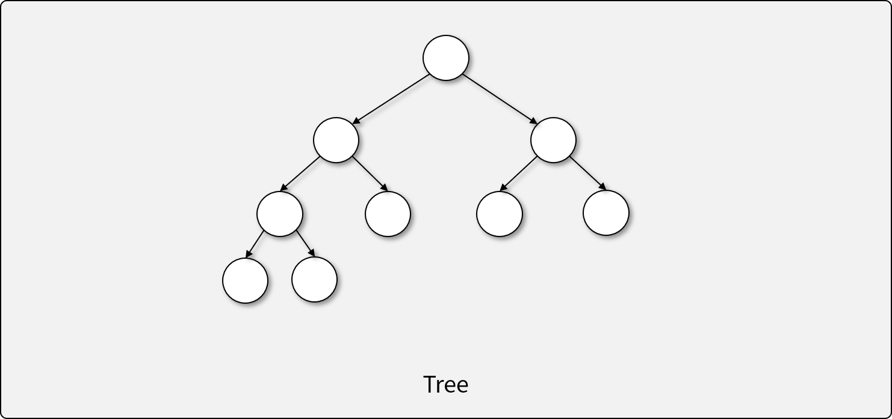
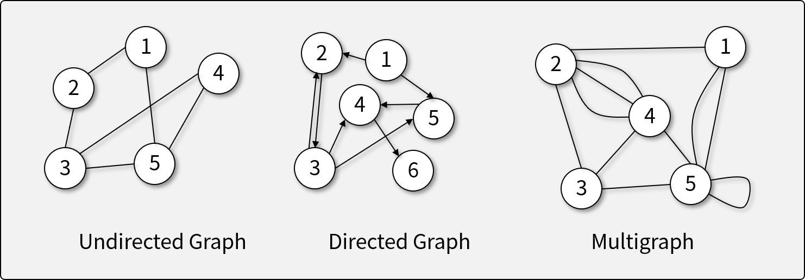
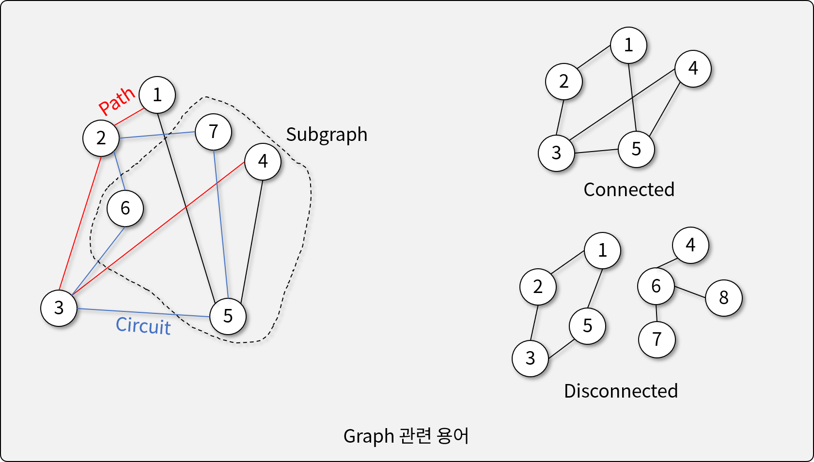
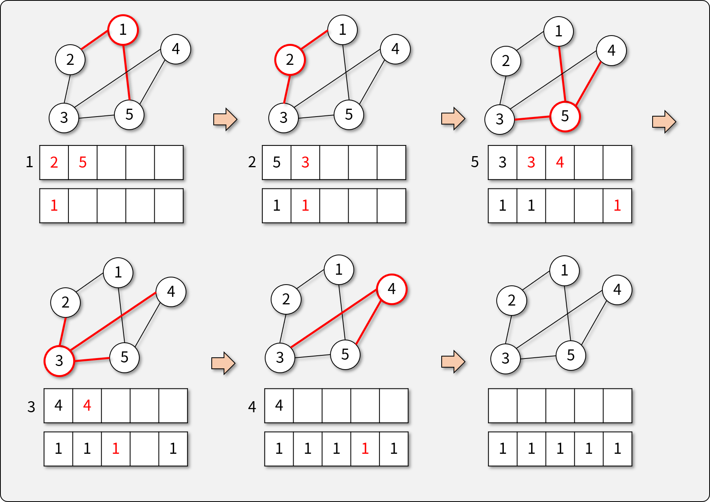
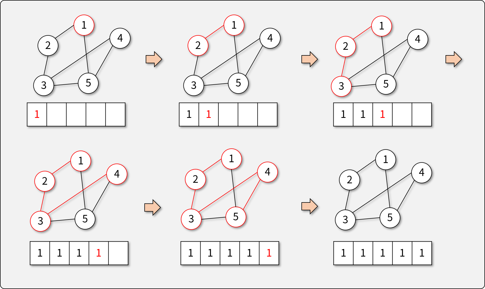

# 그래프 (Graph)

## 그래프란

- 객체 간에 짝을 이루는 구조를 나타내기 위한, 가장 유연한 자료 구조->모든 자료 구조를 표현할 수 있음
- **Vertex**([벌텍스]Node, Point-꼭지점을 의미)와 이를 잇는 **Edge**로 구성되어 있다.
- Edge는 무향(Undirected) 또는 유향(Directed : 방향성이 있음)일 수 있다.
- Edge에는 가중치(Weight)가 있을 수 있으며, 이는 연결의 강도를 나타낸다.
  - 가중치의 대표적인 예 : 교통 네비게이션

## 그래프와 트리의 관계

- 트리는 방향성(유향) 비순환 그래프 **DAG (Directed Acyclic Graph)**의 일종으로 볼 수 있다.
  - 트리에는 회로(Cycle)이 없으며, 루트에서 리프 노드로의 방향성(Direction)이 존재한다.

## 그래프의 종류

- 무향 그래프 (Undirected Graph)
- 유향 그래프 (Directed Graph)
- 다중 그래프 (Multigraph) <-> unigraph
  - 무향 그래프, 유향 그래프에도 unigraph, multigraph로 모두 다 있음.
  - 'recurrent하다' : 멀티 그래프의 5번 vertex와 같이 자기 자신과 연결된 것

## 그래프의 관련 용어

- 경로 (Path) : edge들의 시퀀스. path는 vertex를 포함하지 않고 edge만 포함
- 회로 (Cycle, Circuit) : 어떻게든 자기 자신으로 돌아오는. 특별한 path인 것.
- 부분 그래프 (Subgraph) - 어떤 그래프에 속하는 그래프
- 연결 그래프 (Connected Graph) - 임의의 두 Vertex 사이에 경로가 존재하는 그래프
- Disconnected : 유향 그래프일 경우 더 복잡해짐

## 그래프의 구현 방법

- 인접 리스트 (Adjacency List) - Sparse할 경우 유리함
  
  - 사진에서 2는 1,3,6,7임
- 인접 행렬 (Adjacency Matrix) - Dense할 경우 유리함
  

  - 위의 그림은 무향이면서 weight가 없는 것을 표현한 것임
  - 특징은 무향인 경우 우하향선을 1과 1사이에서 출발해서 그었을 때 그 선을 기준으로 대칭임.
  - 연결이 되지 않은 것까지 다 연결해야 하는 단점이 있으나 하나의 행렬로 한 번에 볼 수 있다는 장점이 있음

## 그래프의 탐색 방법

###1) 너비 우선 탐색 (Breadth-First Search)

- 두 Vertex 사이의 최단 경로 or 임의의 경로를 찾을 때 사용
- 트리와 달리 특정 Node의 방문 여부 `visited`라는 플래그를 검사해야 함
  - 트리는 한 번 검사한 노드는 다시 검사할 일이 없음.
  - 만약 visited가 없을 경우 무한 반복을 하게 됨.
  - 그림에서 두 개의 상자중 밑의 상자가 visited플래그임-> 1부터 5까지 순번이 있음
- 2번 그림은 현재 2를 검사 중인데 1은 이미 검사를 했으므로 안 넣은 거임
- Queue를 이용하여 반복적(Iterative)인 방법으로 손쉽게 구현 가능

###2) 깊이 우선 탐색 (Depth-First Search)

- 모든 Vertex를 방문하고자 할 때 주로 사용 (순회)
- 1에서 2로 갈지 5로 갈지 순서는 없음
- 노드 방문하고 adjacent list를 모두 방문하면 됨
- 트리와 달리 특정 Node의 방문 여부 `visited`를 검사해야 함
- 재귀(Recursive) 함수를 이용하여 전위 순회의 형태로 구현

## [실습] 인접 리스트 기반 그래프 구현하기

- JavaScript의 `Array`와 `class`를 이용해 직접 구현하기
- **구현 조건**
  - `class`와 `Array`를 이용하여 그래프를 구현한다.
  - 그래프의 Vertex 삽입을 구현한다.
    - Vertex 삽입 시, 연결될 인접점(Adjacency Vertices)를 입력 받는다
    - 각 Vertex에 인접 리스트를 이용하여 인접점을 표현한다.
  - 다음과 같은 그래프의 연산을 구현한다.
    - 순회 알고리즘: 시작 Vertex를 입력받고 모든 Vertex를 순회하고, 그 순서를 출력한다.
      1. 넓이 우선 순회 (Breadth-First Traversal)
      1. 깊이 우선 순회 (Depth-First Traversal)
- **참조 코드**
  - [기반 소스 코드](src/before.js)
  - [솔루션 코드](src/after.js)
